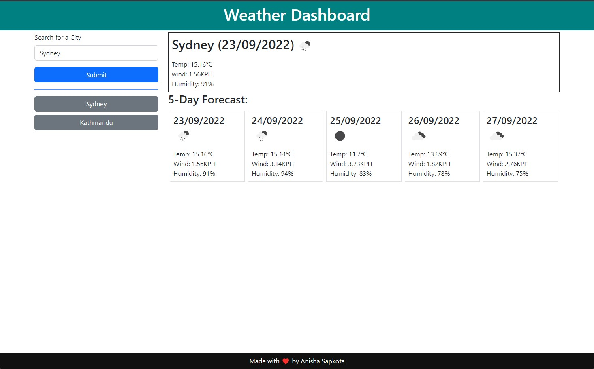

# weather-dashboard

Weather dashboard created using OpenWeather API.

## Features

- Can search for weather forecast by city name.
- Displays 5 day weather forecast including wind speed, and humidity.
- Recent searches are saved to local storage for easy access.

## Screenshot and live url

The weather dashboard can be viewed live at this [url](https://anisha-sapkota.github.io/weather-dashboard/) and the screenshot below.

## Technologies used

- Bootstrap
- Jquery
- Jquery-Ui
- Momentjs
- OpenWeather API
